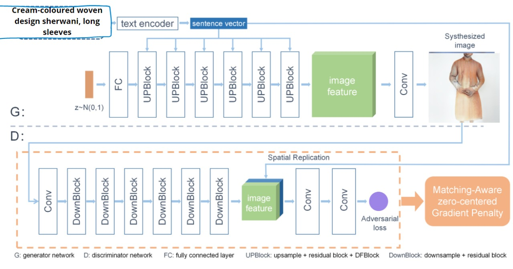
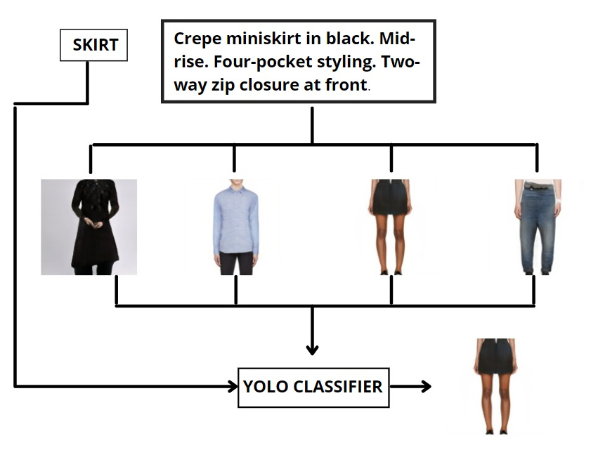

# Text-to-Image Synthesis For Indian Fashion Dataset

## DF_GAN MODEL



## YOLO CLASSIFICATION

 

---
### Requirements
- python 3.6+
- Pytorch 1.0+
- easydict
- nltk
- scikit-image

### Installation

Clone this repo.
```
git clone https://github.com/Dhruvi-Lodhavia/DF-GAN_Indian_Fashion
cd DF-GAN/code/
```

### Datasets Preparation
1. Download the preprocessed metadata for [birds](https://drive.google.com/open?id=1O_LtUP9sch09QH3s_EBAgLEctBQ5JBSJ) [coco](https://drive.google.com/open?id=1rSnbIGNDGZeHlsUlLdahj0RJ9oo6lgH9) and save them to `data/`
2. Download the [birds](http://www.vision.caltech.edu/visipedia/CUB-200-2011.html) image data. Extract them to `data/birds/`
3. Download [coco](http://cocodataset.org/#download) dataset and extract the images to `data/coco/`

### Pre processing data

### Training DF-GAN

**Train DF-GAN models on Indian fashion dataset:**
  - For fashion dataset: `python main.py --cfg cfg/fashion.yml`

### Training YOLO


### Evaluating

**Evaluate DF-GAN models:**

- Download all the models on distributed dataset and save it in inside /ensemble_models
- To evaluate our DF-GAN on distributed training dataset, change B_VALIDATION to True in the fashion.yml. and then run `python main.py --cfg cfg/fashion.yml`
- Results will be saved in different folders inside  /ensemble_images
 
**Classifying using YOLO**


**FID Calculation**

```
!pip install pytorch-fid
!python -m pytorch_fid "path_to_real_images_class" "path_to_generated_images_class"

```

---

**Reference**

- [StackGAN++: Realistic Image Synthesis with Stacked Generative Adversarial Networks](https://arxiv.org/abs/1710.10916) [[code]](https://github.com/hanzhanggit/StackGAN-v2)
- [AttnGAN: Fine-Grained Text to Image Generation with Attentional Generative Adversarial Networks](https://openaccess.thecvf.com/content_cvpr_2018/papers/Xu_AttnGAN_Fine-Grained_Text_CVPR_2018_paper.pdf) [[code]](https://github.com/taoxugit/AttnGAN)
- [DM-GAN: Realistic Image Synthesis with Stacked Generative Adversarial Networks](https://arxiv.org/abs/1904.01310) [[code]](https://github.com/MinfengZhu/DM-GAN)
