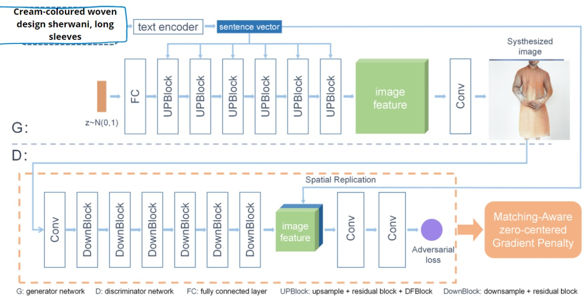

# Text-to-Image Synthesis For Indian Fashion Dataset

## DF_GAN MODEL



## YOLO CLASSIFICATION

 

---
### Requirements
- python 3.6+
- Pytorch 1.0+
- easydict
- nltk
- scikit-image

### Installation

Clone this repo.
```
https://github.com/Dhruvi-Lodhavia/Vastr-GAN.git

```

### Datasets Preparation
  - Download the preprocessed metadata for [fashion](https://drive.google.com/file/d/16HmE7I4GR3aapGRhSQTy7UETTiyYyfxE/view?usp=sharing) and save them to `data/`


### Pre processing data
  - Dataset is collected from e-commerce websites using `python creating_dataset/selenium_trial.py`
  - Text descriptions are cleaned using `python creating_dataset/dataset_cleaning.py`
  - Bounding boxes and class info text files are generated using `creating_dataset/images.py`
### Training DF-GAN

**Train DF-GAN models on Indian fashion dataset:**
  - For fashion dataset: `python main.py --cfg cfg/fashion.yml`

### YOLO saved weights

 - Custom trained yolo [weights](https://drive.google.com/file/d/1CS1PZeIawhd8fikFDy0WIYeBxR_RqfiF/view?usp=sharing) should be save in `YOLOv5` folder.

### Evaluating

**Evaluate DF-GAN models:**

- Download all the models on distributed dataset and save it in inside ensemble_models/ 
- Pretrained models [Models](https://drive.google.com/drive/folders/116nwsIGX-QAwNrIITJ5JQlI_RL0H0jSN?usp=sharing)
- To evaluate our DF-GAN on distributed training dataset, change B_VALIDATION to True in the fashion.yml. and then run `python main.py --cfg cfg/fashion.yml`
- Results will be saved in different folders inside  ensemble_images/
 
**Classifying using YOLO**

- Images from the four models will be saved in the folder `ensemble_images`. Image paths from this folder are given to `YOLOv5/yolo_testing.py`.
- On running `pythonYOLOv5/yolo_testing.py` the desired image is stored as `YOLOv5/max.png`. This is the final image output corresponding to the text input description.


**FID Calculation**

```
!pip install pytorch-fid
!python -m pytorch_fid "path_to_real_images_class" "path_to_generated_images_class"

```

---

**Reference**

- [DF-GAN: Deep Fusion Generative Adversarial Networks for Text-to-Image Synthesis](https://arxiv.org/abs/2008.05865)[[code]](https://github.com/tobran/DF-GAN)
- [StackGAN++: Realistic Image Synthesis with Stacked Generative Adversarial Networks](https://arxiv.org/abs/1710.10916) [[code]](https://github.com/hanzhanggit/StackGAN-v2)
- [AttnGAN: Fine-Grained Text to Image Generation with Attentional Generative Adversarial Networks](https://openaccess.thecvf.com/content_cvpr_2018/papers/Xu_AttnGAN_Fine-Grained_Text_CVPR_2018_paper.pdf) [[code]](https://github.com/taoxugit/AttnGAN)
- [DM-GAN: Realistic Image Synthesis with Stacked Generative Adversarial Networks](https://arxiv.org/abs/1904.01310) [[code]](https://github.com/MinfengZhu/DM-GAN)
- YOLOV5[[code]](https://github.com/ultralytics/yolov5)
